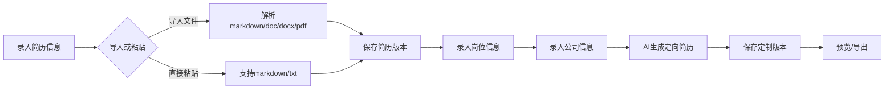
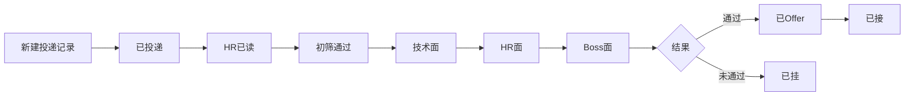

## 1. Product Overview
AI求职助手是一款帮助求职者根据岗位描述、公司信息和个人简历生成定向简历的桌面应用。无需用户登录，数据本地存储，支持多格式简历导入和AI智能定制。

## 2. Core Features

### 2.1 User Roles
| Role | Registration Method | Core Permissions |
|------|---------------------|------------------|
| User | No registration | Full access to all features |

### 2.2 Feature Module
1. **简历管理**: 简历录入、版本管理、导入导出
2. **简历定制**: AI生成定向简历（内置workflow）
3. **投递状态管理**: 全流程状态跟踪、面试进度管理
4. **AI设置**: API Key配置、模型选择

### 2.3 Page Details
| Page Name | Module Name | Feature description |
|-----------|-------------|---------------------|
| 首页 | 仪表盘 | 展示简历概览、投递统计、快捷操作 |
| 简历管理 | 简历列表 | 简历列表展示、版本管理、导入导出 |
| 简历管理 | 简历编辑 | Markdown编辑器、格式预览 |
| 简历定制 | 岗位信息录入 | 岗位描述、公司信息录入 |
| 简历定制 | AI生成 | 一键生成定向简历（内置workflow） |
| 投递管理 | 状态列表 | 投递状态展示、筛选、搜索 |
| 投递管理 | 状态编辑 | 更新面试状态、添加备注 |
| 设置 | AI配置 | API Key输入、模型选择 |

## 3. Core Process

### 3.1 简历定制流程

### 3.2 投递状态管理流程

## 4. User Interface Design

### 4.1 Design Style
- **背景色**: 纯白色 (#ffffff)
- **主色调**: 深蓝色系 (#1e3a5f)，搭配青色点缀 (#00d4aa)
- **按钮风格**: 圆角矩形，简洁扁平化
- **字体**: 中文使用思源黑体，英文使用Inter
- **布局**: 左侧侧边栏导航，右侧内容区域
- **图标**: Lucide图标库，简洁线性风格

### 4.2 Page Design Overview
| Page Name | Module Name | UI Elements |
|-----------|-------------|-------------|
| 首页 | 仪表盘 | 统计卡片、快捷入口、最近活动 |
| 简历管理 | 简历列表 | 卡片列表、版本标签、操作按钮 |
| 简历定制 | AI生成 | 一键生成按钮、生成进度、结果预览 |
| 投递管理 | 状态列表 | 时间线视图、状态徽章、筛选器 |
| 设置 | AI配置 | 表单输入、模型选择下拉框 |

### 4.3 Responsiveness
- 桌面端优先设计
- 支持窗口缩放自适应
- 移动端触控优化

### 4.4 Navigation
- 左侧固定侧边栏
- 图标+文字导航项
- 当前页面高亮标识