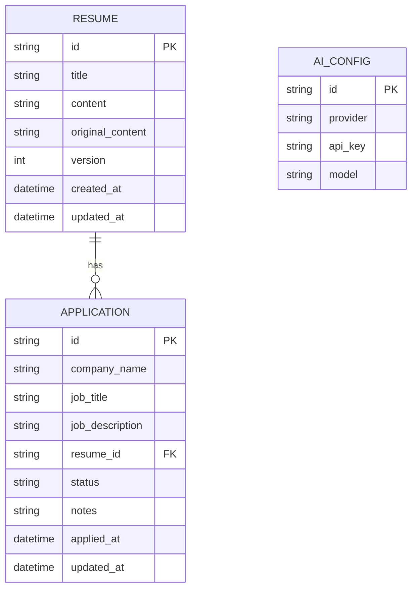

## 1. Architecture Design
```mermaid
flowchart TB
    subgraph Frontend [Tauri Desktop App]
        A[Vue3 + TypeScript] --> B[TailwindCSS]
        A --> C[Vue Router]
        A --> D[Pinia]
        A --> E[Lucide Icons]
        A --> F[Markdown Editor]
    end
    
    subgraph Data [Local Storage]
        G[SQLite] --> H[Local Files]
    end
    
    subgraph External Services
        I[DeepSeek API]
        J[Custom AI API]
    end
    
    Frontend --> Data
    Frontend --> External Services
```

## 2. Technology Description
- **Frontend**: Vue@3 + TypeScript + TailwindCSS@3
- **Desktop Framework**: Tauri@2
- **State Management**: Pinia
- **Routing**: Vue Router
- **Icons**: Lucide Vue Next
- **Markdown**: Marked + Highlight.js
- **Database**: SQLite (via Tauri Plugin)
- **AI Integration**: DeepSeek API + Custom API Key

## 3. Route Definitions
| Route | Purpose |
|-------|---------|
| / | 首页仪表盘 |
| /resumes | 简历列表 |
| /resumes/:id | 简历详情/编辑 |
| /customize | 简历定制 |
| /applications | 投递管理 |
| /applications/:id | 投递详情 |
| /settings | 设置页面 |

## 4. API Definitions

### 4.1 AI Generation API
**POST** /api/generate-resume
- Request Body:
```typescript
interface GenerateRequest {
  resumeContent: string;
  jobDescription: string;
  companyInfo: string;
}
```
- Response:
```typescript
interface GenerateResponse {
  success: boolean;
  content: string;
  version: string;
}
```

### 4.2 Local Database Schema
```typescript
interface Resume {
  id: string;
  title: string;
  content: string;
  originalContent: string;
  version: number;
  createdAt: Date;
  updatedAt: Date;
}

interface Application {
  id: string;
  companyName: string;
  jobTitle: string;
  jobDescription: string;
  resumeId: string;
  status: 'applied' | 'hr_read' | 'screen_pass' | 'technical' | 'hr' | 'boss' | 'offer' | 'rejected';
  notes: string;
  appliedAt: Date;
  updatedAt: Date;
}

interface AIConfig {
  id: string;
  provider: 'deepseek' | 'custom';
  apiKey: string;
  model: string;
}
```

## 5. Data Model

### 5.1 ER Diagram


### 5.2 DDL Statements
```sql
CREATE TABLE resumes (
    id TEXT PRIMARY KEY,
    title TEXT NOT NULL,
    content TEXT NOT NULL,
    original_content TEXT NOT NULL,
    version INTEGER DEFAULT 1,
    created_at DATETIME DEFAULT CURRENT_TIMESTAMP,
    updated_at DATETIME DEFAULT CURRENT_TIMESTAMP
);

CREATE TABLE applications (
    id TEXT PRIMARY KEY,
    company_name TEXT NOT NULL,
    job_title TEXT NOT NULL,
    job_description TEXT,
    resume_id TEXT REFERENCES resumes(id),
    status TEXT NOT NULL DEFAULT 'applied',
    notes TEXT,
    applied_at DATETIME DEFAULT CURRENT_TIMESTAMP,
    updated_at DATETIME DEFAULT CURRENT_TIMESTAMP
);

CREATE TABLE ai_config (
    id TEXT PRIMARY KEY DEFAULT 'default',
    provider TEXT NOT NULL DEFAULT 'deepseek',
    api_key TEXT,
    model TEXT NOT NULL DEFAULT 'deepseek-chat'
);
```

## 6. Project Structure
```
src/
├── components/          # 公共组件
│   ├── Layout/         # 布局组件
│   ├── Resume/         # 简历相关组件
│   ├── Application/    # 投递相关组件
│   └── UI/             # UI基础组件
├── views/              # 页面视图
│   ├── Dashboard.vue   # 仪表盘
│   ├── ResumeList.vue  # 简历列表
│   ├── ResumeDetail.vue # 简历详情
│   ├── Customize.vue   # 简历定制
│   ├── ApplicationList.vue # 投递列表
│   ├── ApplicationDetail.vue # 投递详情
│   └── Settings.vue    # 设置页面
├── stores/             # Pinia状态管理
│   ├── resume.ts       # 简历状态
│   ├── application.ts  # 投递状态
│   └── ai.ts           # AI配置状态
├── composables/        # 组合式函数
│   ├── useResume.ts    # 简历操作
│   ├── useApplication.ts # 投递操作
│   └── useAI.ts        # AI调用（内置workflow）
├── utils/              # 工具函数
│   ├── db.ts           # 数据库操作
│   ├── markdown.ts     # Markdown处理
│   ├── ai.ts           # AI接口封装（内置workflow prompt）
│   └── fileParser.ts   # 文件解析（doc/docx/pdf）
├── router/             # 路由配置
│   └── index.ts
├── types/              # 类型定义
│   └── index.ts
└── App.vue
```